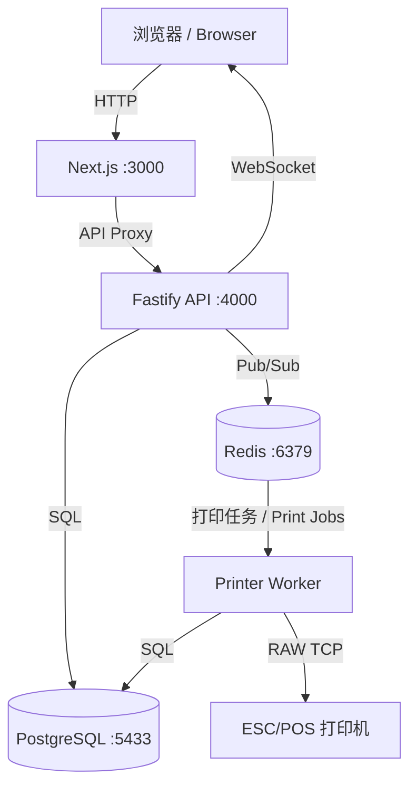

# 🍜 QYPOS · 秦云 POS

<p align="center">
  
  
  
  
  
  
</p>

<p align="center">
  <strong>开源轻量级餐饮 POS 系统</strong><br>
  <sub>Open-source lightweight restaurant POS system — built for single-store local deployment</sub>
</p>

---

## 📖 目录 / Table of Contents

- [项目简介 / Overview](#-项目简介--overview)
- [功能特性 / Features](#-功能特性--features)
- [技术栈 / Tech Stack](#-技术栈--tech-stack)
- [快速开始 / Quick Start](#-快速开始--quick-start)
- [项目架构 / Architecture](#-项目架构--architecture)
- [配置说明 / Configuration](#-配置说明--configuration)
- [API 概览 / API Overview](#-api-概览--api-overview)
- [测试 / Testing](#-测试--testing)
- [备份与恢复 / Backup & Restore](#-备份与恢复--backup--restore)
- [路线图 / Roadmap](#-路线图--roadmap)
- [贡献指南 / Contributing](#-贡献指南--contributing)
- [许可证 / License](#-许可证--license)

---

## 📋 项目简介 / Overview

**QYPOS**（秦云 POS）是一款专为小型餐饮门店设计的开源 POS 系统。它提供了完整的前台点餐、后厨打印、后台管理闭环，支持堂食与外卖两种业务模式。

> **QYPOS** (Qinyun POS) is an open-source POS system designed for small restaurant businesses. It provides a complete loop of front-desk ordering, kitchen printing, and back-office management, supporting both dine-in and takeaway modes.

核心设计理念 / Core Principles：

| 中文 | English |
|------|---------|
| **单店本地部署** — Docker Compose 一键启动，无需云服务 | **Single-store local deployment** — One-command startup with Docker Compose, no cloud required |
| **离线可用** — 纯本地网络运行，不依赖外网 | **Offline capable** — Runs entirely on local network, no internet dependency |
| **真实厨房场景** — 后厨打印、菜品状态追踪、多打印机路由 | **Real kitchen workflow** — Kitchen printing, item status tracking, multi-printer routing |
| **灵活配置** — 税率、服务费、含税/未税定价自由组合 | **Flexible settings** — Tax rate, service charge, tax-inclusive/exclusive pricing |

---

## ✨ 功能特性 / Features

### 🛎️ 点餐前台 / POS Front Desk
- 可视化餐桌地图，支持拖拽布局编辑 / Visual table map with drag-and-drop layout editor
- 堂食开台 + 外卖下单双模式 / Dine-in table opening + takeaway order creation
- 菜品分类浏览、规格选择、加料/备注 / Menu category browsing, variant selection, modifiers & notes
- 订单加菜、折扣、服务费调整 / Order add-items, discount, service charge adjustment
- 多种支付方式记录（现金/刷卡/扫码/其他） / Multiple payment methods (cash/card/QR/other)
- 餐桌状态实时更新（WebSocket） / Real-time table status via WebSocket

### 🖨️ 后厨打印 / Kitchen Printing
- ESC/POS 网络打印机支持 / ESC/POS network printer support
- 厨房单 + 收银小票拆分打印 / Separate kitchen ticket & receipt printing
- 多打印机路由（厨房/收银/吧台独立配置） / Multi-printer routing (kitchen/receipt/bar)
- 打印失败自动重试机制 / Automatic print retry on failure
- 菜品级制作状态追踪（制作中 → 待上菜 → 已上菜） / Item-level cooking status tracking

### 📊 后台管理 / Back Office
- **菜单管理 / Menu Management**：分类、菜品、规格、加料组的完整 CRUD / Full CRUD for categories, items, variants, modifier groups
- **餐桌布局 / Table Layout**：可视化拖拽编辑器，区域管理，复制/删除桌台 / Visual editor with zones, copy/delete tables
- **设置中心 / Settings**：税率、服务费、币种、打印机配置 / Tax, service charge, currency, printer config
- **数据看板 / Dashboard**：今日营业额、订单数、客单价、热销菜品 / Today's revenue, order count, avg. ticket, top sellers
- **销售报表 / Sales Reports**：历史数据查询、CSV 导出 / Historical data with CSV export
- **审计日志 / Audit Log**：敏感操作全程记录 / Full audit trail for sensitive operations

### 🔧 运维功能 / Operations
- 数据库自动/手动备份，支持下载 / Auto & manual DB backups with download
- 服务健康检查面板 / Service health check panel
- 浏览器离线/断网状态提示 / Offline & disconnection banners

---

## 🛠 技术栈 / Tech Stack

| 层级 / Layer | 技术 / Technology |
|-------------|-------------------|
| 前端 / Frontend | [Next.js 14](https://nextjs.org/) + React 18 + [Lucide Icons](https://lucide.dev/) |
| API 服务 / API | [Fastify](https://fastify.dev/) + WebSocket |
| 数据库 / Database | [PostgreSQL 16](https://www.postgresql.org/) |
| 缓存队列 / Cache & Queue | [Redis 7](https://redis.io/) |
| 打印服务 / Print Worker | Node.js + ESC/POS 位图渲染 / bitmap rendering ([@napi-rs/canvas](https://github.com/Brooooooklyn/canvas)) |
| 部署 / Deployment | [Docker Compose](https://docs.docker.com/compose/) |
| 测试 / Testing | Node.js Native Test Runner |

---

## 🚀 快速开始 / Quick Start

### 前置条件 / Prerequisites

- [Docker](https://docs.docker.com/get-docker/) & Docker Compose
- Node.js ≥ 18（仅本地开发需要 / only needed for local development）

### 一键启动 / One-Click Start

```bash
# 1. 克隆项目 / Clone the repo
git clone https://github.com/dodio12138/QYPOS.git
cd QYPOS

# 2. 创建环境配置 / Create env config
cp .env.example .env

# 3. 启动所有服务 / Start all services
docker compose up --build
```

### 访问入口 / Access Points

| 服务 / Service | 地址 / URL |
|---------------|-----------|
| 🛎️ 点餐前台 / POS | http://localhost:3000 |
| ⚙️ 后台管理 / Admin | http://localhost:3000/admin |
| 💚 API 健康检查 / Health | http://localhost:4000/health |

### 种子账号 / Seed Accounts

| 角色 / Role | 用户名 / Username | PIN |
|------------|------------------|-----|
| 店主 / Owner | `Owner` | `0000` |
| 收银员 / Cashier | `Cashier` | `1111` |
| 后厨 / Kitchen | `Kitchen` | `2222` |

> ⚠️ **安全提示 / Security Notice**：生产环境请务必修改默认 PIN 码。 / Please change default PINs before production use.

---

## 🏗 项目架构 / Architecture

```
qypos/
├── apps/
│   ├── web/                   # Next.js 前端 / Frontend (POS + Admin)
│   │   ├── src/app/           # 页面路由 / Page routes
│   │   ├── src/components/    # 共享组件 / Shared components
│   │   └── src/lib/           # API 客户端 / API client
│   ├── api/                   # Fastify 后端 API
│   │   └── src/
│   │       ├── server.js      # 主服务入口 / Main entry
│   │       └── services/      # 业务服务 / Business services
│   │           ├── permissions.js   # 权限校验 / Permission checks
│   │           ├── printers.js      # 打印机路由 / Printer routing
│   │           └── validation.js    # 数据校验 / Data validation
│   └── printer-service/       # 打印队列 Worker / Print queue worker
│       └── src/worker.js      # Redis 消费 + ESC/POS 渲染
├── packages/
│   └── shared/                # 共享代码包 / Shared package
│       └── src/index.js       # 金额计算 + 常量 / Money calc + constants
├── db/
│   ├── init.sql               # 数据库初始化 / DB schema + seed data
│   └── migrations/            # 增量迁移脚本 / Incremental migrations
├── scripts/
│   ├── backup-db.sh           # 数据库备份 / DB backup script
│   └── restore-db.sh          # 数据库恢复 / DB restore script
├── tests/                     # 测试用例 / Test suites
├── docker-compose.yml         # Docker 编排 / Orchestration
└── .env.example               # 环境变量模板 / Env template
```

### 服务间通信 / Service Communication



---

## ⚙️ 配置说明 / Configuration

通过 `.env` 文件进行配置 / Configure via `.env` file：

| 变量 / Variable | 默认值 / Default | 说明 / Description |
|----------------|-----------------|-------------------|
| `POSTGRES_DB` | `qypos` | 数据库名称 / Database name |
| `POSTGRES_USER` | `qypos` | 数据库用户 / Database user |
| `POSTGRES_PASSWORD` | `qypos_password` | 数据库密码 / Database password |
| `DATABASE_URL` | `postgres://...` | API 数据库连接串 / API DB connection string |
| `REDIS_URL` | `redis://redis:6379` | Redis 连接串 / Redis connection string |
| `API_PORT` | `4000` | API 服务端口 / API server port |
| `PRINTER_DEFAULT_HOST` | `192.168.1.100` | 默认打印机 IP / Default printer IP |
| `PRINTER_DEFAULT_PORT` | `9100` | 默认打印机端口 / Default printer port |
| `BACKUP_DIR` | `/app/backups` | 备份文件存储路径 / Backup storage path |

---

## 📡 API 概览 / API Overview

| 端点 / Endpoint | 方法 / Method | 说明 / Description | 权限 / Permission |
|----------------|--------------|-------------------|-------------------|
| `/auth/login` | POST | 用户登录（返回 Token） / Login | 公开 / Public |
| `/floor-layouts` | GET/PUT | 餐桌布局读写 / Table layout CRUD | 读公开 / 写需登录 |
| `/orders` | POST | 创建订单 / Create order | `create_order` |
| `/orders/:id/submit` | POST | 提交订单并触发打印 / Submit & print | `create_order` |
| `/orders/:id/payments` | POST | 记录付款 / Record payment | `take_payment` |
| `/orders/:id/items` | POST | 加菜 / Add items | `create_order` |
| `/menu/categories` | CRUD | 菜单分类管理 / Category mgmt | `manage_menu` |
| `/menu/items` | CRUD | 菜品管理 / Item mgmt | `manage_menu` |
| `/settings` | GET/PUT | 系统设置 / System settings | 读公开 / 写需权限 |
| `/dashboard/today` | GET | 今日看板数据 / Today's dashboard | `view_dashboard` |
| `/reports/sales` | GET | 销售报表 / Sales reports | `view_reports` |
| `/print-jobs` | GET | 打印任务列表 / Print job list | `view_kitchen` |
| `/health` | GET | 服务健康检查 / Health check | 公开 / Public |

---

## 🧪 测试 / Testing

```bash
# 运行全部测试 / Run all tests
npm test

# 仅运行计算逻辑测试 / Calculation tests only
node --test tests/calculations.test.mjs

# 运行 API 集成测试（需要已启动服务） / API integration (requires running server)
API_BASE=http://localhost:4000 node --test tests/api.integration.test.mjs
```

测试覆盖 / Test Coverage：
- ✅ 金额计算（含税/未税、折扣、服务费） / Money calculation (tax, discount, service charge)
- ✅ 权限校验逻辑 / Permission validation
- ✅ 厨房打印锁定 / Kitchen print locking
- ✅ 付款金额校验 / Payment amount validation
- ✅ 打印机严格路由 / Strict printer routing
- ✅ API 集成测试（可选） / API integration tests (optional)

---

## 💾 备份与恢复 / Backup & Restore

```bash
# 创建备份 / Create backup
npm run backup

# 从备份恢复 / Restore from backup
npm run restore -- backups/qypos-YYYYMMDD-HHMMSS.sql
```

也可以在后台管理界面（/admin → 运维）中手动触发备份、设置自动备份计划或下载备份文件。

> You can also trigger backups manually, set auto-backup schedules, or download backup files from the Admin panel (/admin → Operations).

---

## 🗺️ 路线图 / Roadmap

### 当前版本 / Current (v0.1.0) — MVP
- [x] 点餐前台 + 后台管理完整闭环 / POS + Admin full loop
- [x] 堂食 & 外卖双模式 / Dine-in & takeaway modes
- [x] ESC/POS 网络打印 / ESC/POS network printing
- [x] 可视化餐桌布局编辑 / Visual table layout editor
- [x] 菜单全量管理 / Full menu management
- [x] 税率/服务费灵活配置 / Flexible tax & service charge
- [x] 基础看板 & 销售报表 / Dashboard & sales reports
- [x] 数据库备份恢复 / DB backup & restore

### 下一阶段 / Next (v0.2.0)
- [ ] 员工管理 UI（增删改查、PIN 哈希） / Staff management UI
- [ ] 菜单图片上传 / Menu image upload
- [ ] 套餐组合功能 / Combo meal support
- [ ] 报表可视化图表 / Report visualization charts
- [ ] 班次交接 & 日结 / Shift handover & daily settlement
- [ ] 真实支付终端对接 / Real payment terminal integration
- [ ] 多语言前端（中/英完整覆盖） / Full i18n (zh/en)

### 未来规划 / Future (v0.3.0+)
- [ ] 多店支持 / Multi-store support
- [ ] 扫码点餐（顾客端） / QR code ordering (customer side)
- [ ] 库存管理 / Inventory management
- [ ] 会员系统 / Membership system
- [ ] 第三方外卖平台对接 / 3rd-party delivery platform integration

---

## 🤝 贡献指南 / Contributing

我们欢迎所有形式的贡献！请查看 [CONTRIBUTING.md](./CONTRIBUTING.md) 了解详情。

> All contributions are welcome! See [CONTRIBUTING.md](./CONTRIBUTING.md) for details.

### 本地开发 / Local Development

```bash
# 1. 安装依赖 / Install dependencies
npm install

# 2. 启动基础设施 / Start infrastructure
docker compose up -d postgres redis

# 3. 分别启动各服务开发模式 / Start services in dev mode
cd apps/api && npm run dev          # API :4000
cd apps/web && npm run dev          # Web :3000
cd apps/printer-service && npm run dev  # Printer Worker
```

---

## 📄 许可证 / License

本项目基于 [MIT License](./LICENSE) 开源。 / This project is open-sourced under the [MIT License](./LICENSE).

---

<p align="center">
  <sub>Made with ❤️ for small restaurants everywhere 🍜</sub>
</p>
