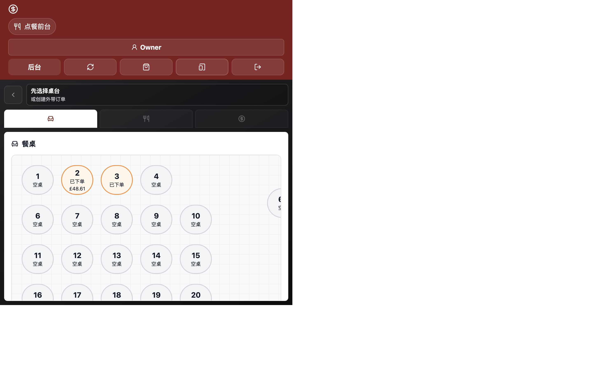
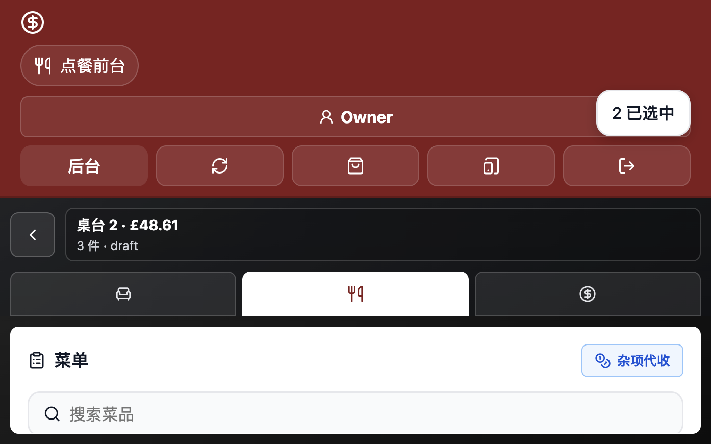
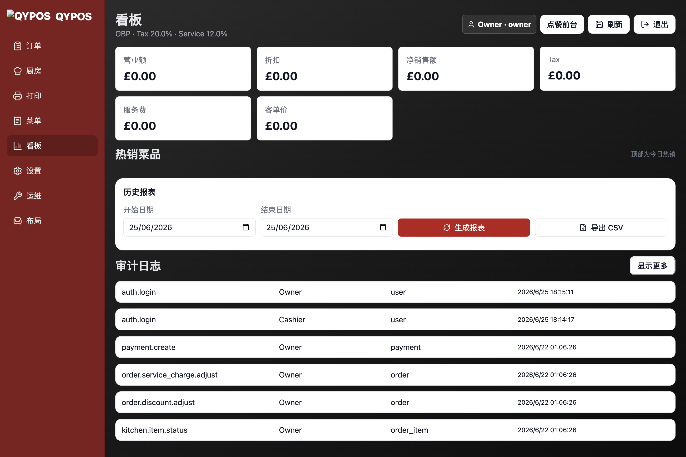
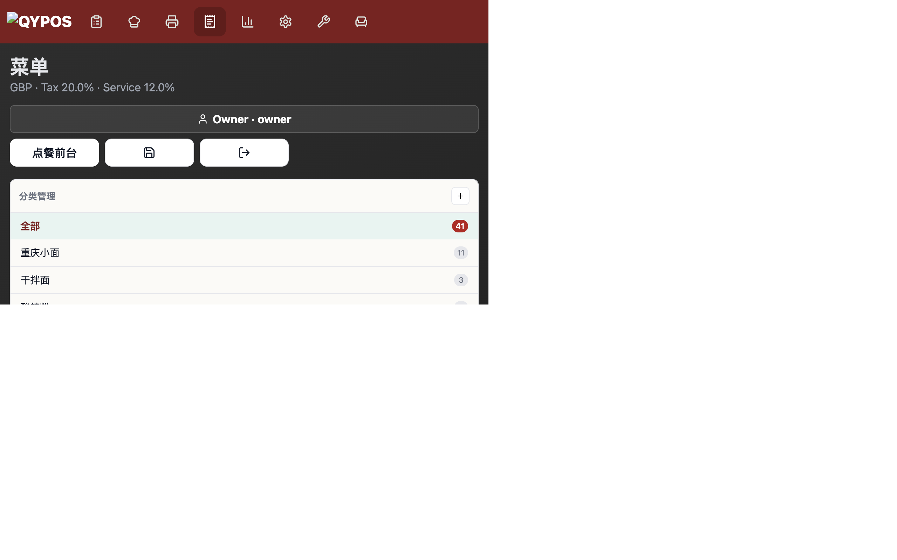
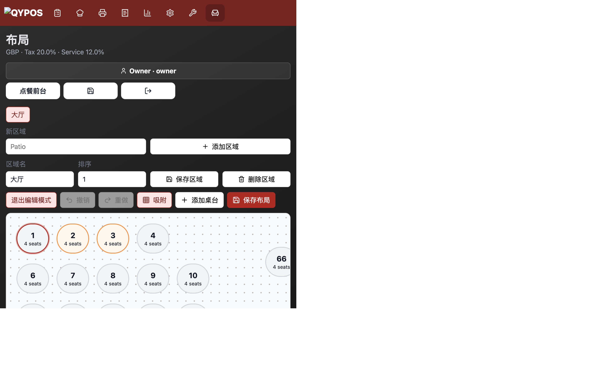
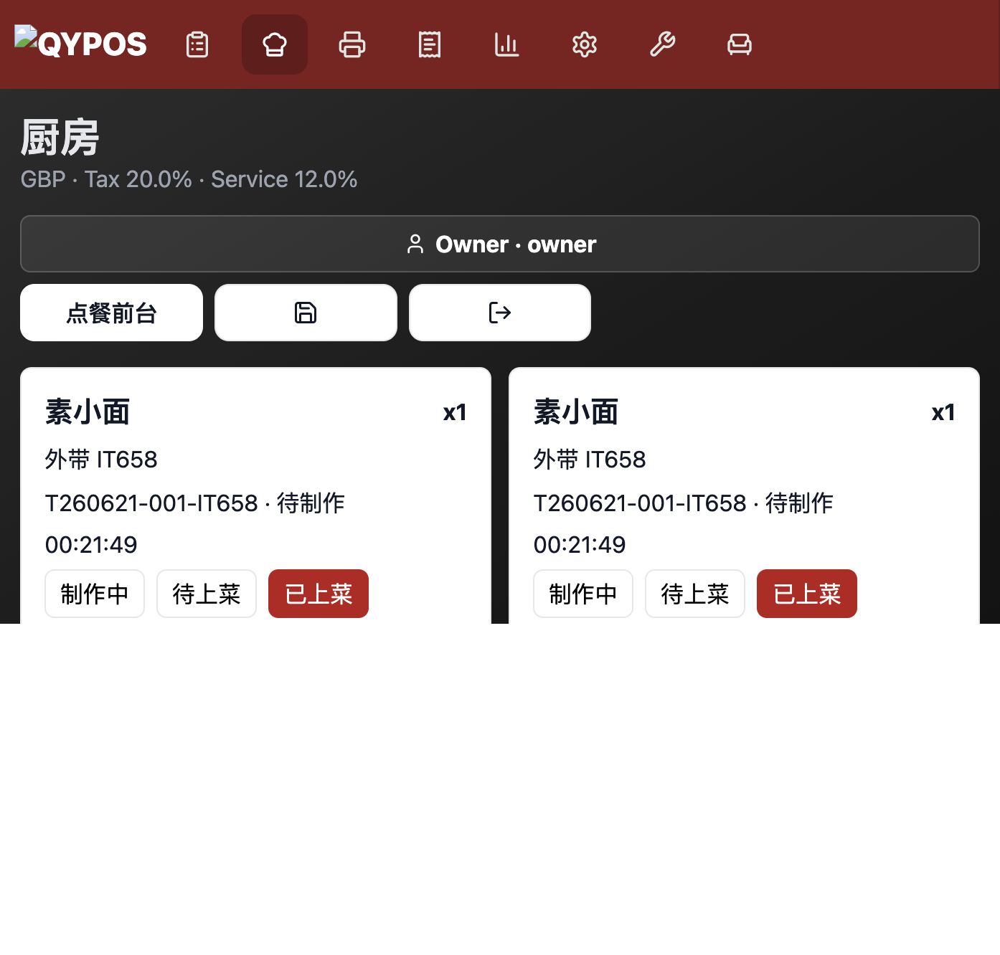
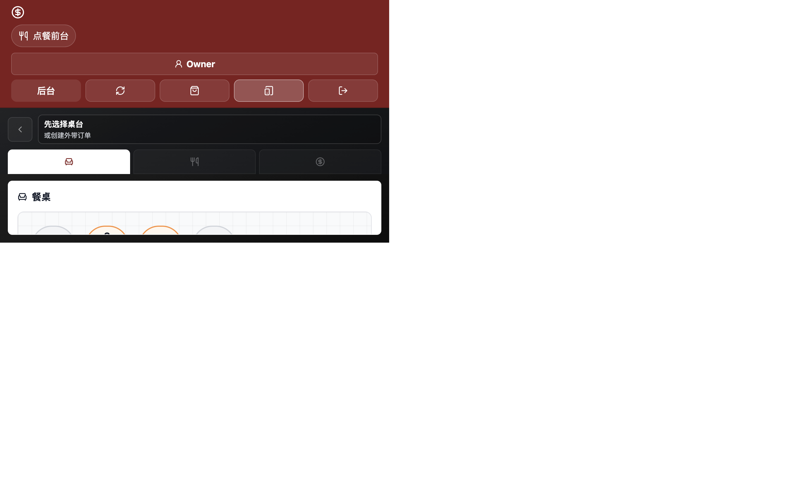
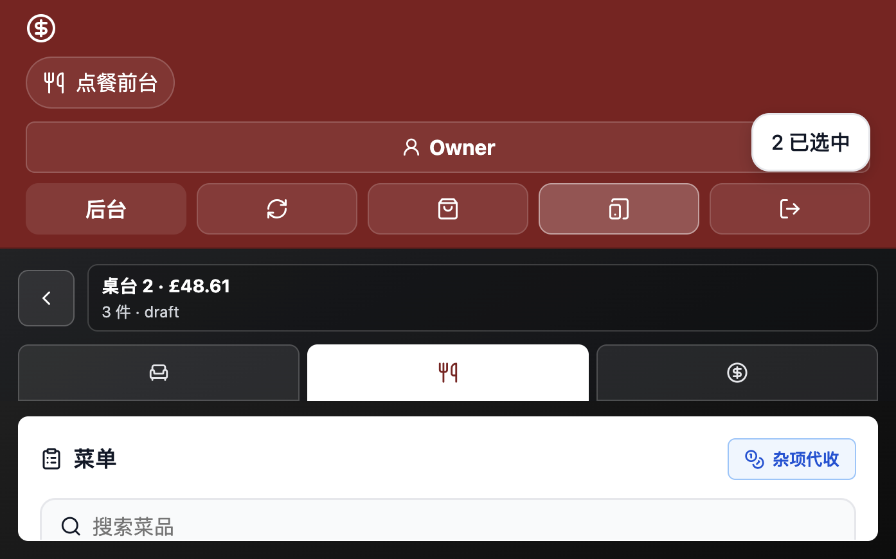
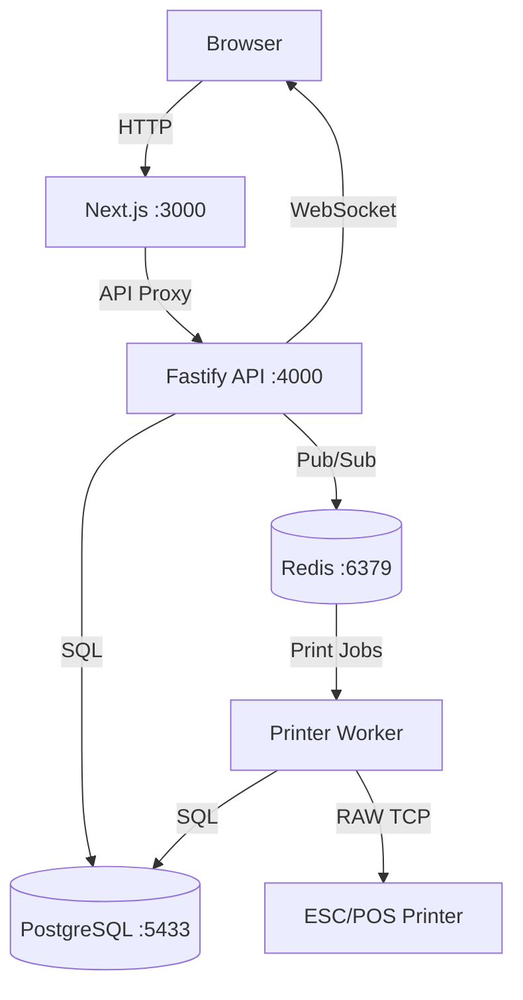

# 🍜 QYPOS

<p align="center">
  <a href="./README_zh.md"></a>
  <a href="./README.md"></a>
</p>

<p align="center">
  
  
  
  
  
  
  
  
</p>

<p align="center"><strong>Open-source lightweight restaurant POS system</strong> — built for single-store local deployment</p>

---

## � Screenshots

### 🖥️ Desktop

<p align="center">
  
  
  
</p>
<p align="center">
  
  
  
</p>

### 📱 Tablet Mode

<p align="center">
  
  
</p>

---

## �📖 Table of Contents

- [Overview](#-overview)
- [Features](#-features)
- [Tech Stack](#-tech-stack)
- [Quick Start](#-quick-start)
- [Architecture](#-architecture)
- [Configuration](#-configuration)
- [API Overview](#-api-overview)
- [Versioning](#-versioning)
- [Testing](#-testing)
- [Backup & Restore](#-backup--restore)
- [Roadmap](#-roadmap)
- [Contributing](#-contributing)
- [License](#-license)

---

## 📋 Overview

**QYPOS** (Qinyun POS) is an open-source POS system designed for small restaurant businesses. It provides a complete loop of front-desk ordering, kitchen printing, and back-office management, supporting both dine-in and takeaway modes.

Core Principles:

| Principle | Description |
|-----------|-------------|
| **Single-store local deployment** | One-command startup with Docker Compose, no cloud required |
| **Offline capable** | Runs entirely on local network, no internet dependency |
| **Real kitchen workflow** | Kitchen printing, item status tracking, multi-printer routing |
| **Flexible settings** | Tax rate, service charge, tax-inclusive/exclusive pricing |

---

## ✨ Features

### 🛎️ POS Front Desk
- Visual table map with drag-and-drop layout editor
- Dine-in table opening + takeaway order creation with confirmation step
- Login gate: all POS operations require staff authentication
- Menu category browsing, variant selection, modifiers & notes
- Required/optional modifier groups with default selections
- Order add-items, discount (capped to subtotal), service charge adjustment
- Multiple payment methods: cash, card, QR, other, and **Dojo Go** terminal
- Real-time table status via WebSocket

### 🖨️ Kitchen Printing
- ESC/POS network printer support
- Separate kitchen ticket & receipt printing
- Multi-printer routing (kitchen/receipt/bar) — strict mode, no silent fallback
- New-items-only locking: already-printed items never re-print
- Automatic print retry on failure with job management UI
- Receipts include variants, modifiers, unit prices, and line totals
- Item-level cooking status tracking (preparing → ready → served)

### 📊 Back Office
- **Menu Management**: Full CRUD plus synchronized variant presets and group-level modifier presets with ordering and automatic detachment after direct edits
- **Table Layout**: Visual editor with zones, copy/delete tables, grid snapping, undo/redo
- **Staff Management**: Employee CRUD, role-based permissions (owner vs cashier with fine-grained access control), schedules, attendance tracking, and hourly wage
- **Settings**: Tax, service charge, currency, printer config; sensitive tax changes require current-account PIN confirmation
- **Dashboard**: Today's revenue, order count, avg. ticket, top sellers with multi-select drilldown and merged trend charts
- **Sales Reports**: Historical data with day-of-week filter, expanded date presets (yesterday / this week / last week / last month), visual charts, and CSV export
- **Audit Log**: Full audit trail with combined user, action, and exact time-range filters
- **i18n**: Full Chinese / English coverage across POS and Admin interfaces
- **Code Quality**: ESLint flat config with `no-undef` rule, integrated into CI pipeline

### 🔧 Operations
- Auto & manual DB backups with download and scheduling UI
- Service health check panel (DB, Redis, print queue, backup status)
- Offline & disconnection banners with API health failure alerts
- Dojo Go payment terminal integration (Pay at Counter)

---

## 🛠 Tech Stack

| Layer | Technology |
|-------|-----------|
| Frontend | [Next.js 14](https://nextjs.org/) + React 18 + [Lucide Icons](https://lucide.dev/) |
| API | [Fastify](https://fastify.dev/) + WebSocket |
| Database | [PostgreSQL 16](https://www.postgresql.org/) |
| Cache & Queue | [Redis 7](https://redis.io/) |
| Print Worker | Node.js + ESC/POS bitmap rendering ([@napi-rs/canvas](https://github.com/Brooooooklyn/canvas)) |
| Deployment | [Docker Compose](https://docs.docker.com/compose/) |
| Testing | Node.js Native Test Runner |

---

## 🚀 Quick Start

### Prerequisites

- [Docker](https://docs.docker.com/get-docker/) & Docker Compose
- Node.js ≥ 18 (for local development only)

### One-Click Start

```bash
# 1. Clone the repo
git clone https://github.com/dodio12138/QYPOS.git
cd QYPOS

# 2. Create env config
cp .env.example .env

# 3. Start all services
docker compose up --build
```

### Access Points

| Service | URL |
|---------|-----|
| 🛎️ POS | http://localhost:3000 |
| ⚙️ Admin | http://localhost:3000/admin |
| 💚 Health Check | http://localhost:4000/health |

### Dojo terminal payments (Pay at Counter)

QYPOS supports Dojo Go terminal payments while keeping manual cash, card, QR, and other payment records. Configure these server-only values in `.env`:

```env
DOJO_API_KEY=sk_sandbox_or_prod_key
DOJO_API_BASE_URL=https://api.dojo.tech
DOJO_API_VERSION=2026-02-27
DOJO_SOFTWARE_HOUSE_ID=your_software_house_id
DOJO_RESELLER_ID=your_reseller_id
```

For sandbox keys, only `DOJO_API_KEY` is required; QYPOS uses Dojo's sandbox terminal defaults (`softwareHouse1` and `reseller1`) plus the standard API URL/version. Production keys must use the software-house and reseller IDs assigned by Dojo. Never expose the API key through a `NEXT_PUBLIC_*` variable. Run `docker compose up -d --build api web` after configuration. A terminal payment is recorded only after the Dojo Payment Intent reaches `Captured`; if the result is uncertain, check the terminal display or receipt before recording it manually to avoid a duplicate charge.

### Seed Accounts

| Role | Username | PIN |
|------|----------|-----|
| Owner | `Owner` | `0000` |
| Cashier | `Cashier` | `1111` |
| Kitchen | `Kitchen` | `2222` |

> ⚠️ **Security Notice**: Please change default PINs before production use.

---

## 🏗 Architecture

```
qypos/
├── apps/
│   ├── web/                   # Next.js Frontend (POS + Admin)
│   │   ├── src/app/           # Page routes
│   │   ├── src/components/    # Shared components
│   │   └── src/lib/           # API client
│   ├── api/                   # Fastify Backend API
│   │   └── src/
│   │       ├── server.js      # Main entry
│   │       └── services/      # Business services
│   │           ├── permissions.js   # Permission checks
│   │           ├── printers.js      # Printer routing
│   │           └── validation.js    # Data validation
│   └── printer-service/       # Print Queue Worker
│       └── src/worker.js      # Redis consumer + ESC/POS renderer
├── packages/
│   └── shared/                # Shared package
│       └── src/index.js       # Money calculation + constants
├── db/
│   ├── init.sql               # DB schema + seed data
│   └── migrations/            # Incremental migrations
├── scripts/
│   ├── backup-db.sh           # DB backup script
│   └── restore-db.sh          # DB restore script
├── tests/                     # Test suites
├── docker-compose.yml         # Docker orchestration
└── .env.example               # Environment template
```

### Service Communication



---

## ⚙️ Configuration

Configure via `.env` file:

| Variable | Default | Description |
|----------|---------|-------------|
| `POSTGRES_DB` | `qypos` | Database name |
| `POSTGRES_USER` | `qypos` | Database user |
| `POSTGRES_PASSWORD` | `qypos_password` | Database password |
| `DATABASE_URL` | `postgres://...` | API DB connection string |
| `REDIS_URL` | `redis://redis:6379` | Redis connection string |
| `API_PORT` | `4000` | API server port |
| `PRINTER_DEFAULT_HOST` | `192.168.1.100` | Default printer IP |
| `PRINTER_DEFAULT_PORT` | `9100` | Default printer port |
| `BACKUP_DIR` | `/app/backups` | Backup storage path |

---

## 📡 API Overview

| Endpoint | Method | Description | Permission |
|----------|--------|-------------|------------|
| `/auth/login` | POST | Login (returns token) | Public |
| `/floor-layouts` | GET/PUT | Table layout CRUD | Read: public / Write: auth |
| `/orders` | POST | Create order | `create_order` |
| `/orders/:id/submit` | POST | Submit order & trigger print | `create_order` |
| `/orders/:id/payments` | POST | Record payment | `take_payment` |
| `/orders/:id/items` | POST | Add items to order | `create_order` |
| `/menu/categories` | CRUD | Category management | `manage_menu` |
| `/menu/items` | CRUD | Item management | `manage_menu` |
| `/menu/option-presets` | CRUD | Variant and modifier preset management | `manage_menu` |
| `/menu/modifier-groups/:id/apply-option-preset` | POST | Bind a preset to one modifier group | `manage_menu` |
| `/settings` | GET/PUT | System settings | Read: public / Write: auth |
| `/dashboard/today` | GET | Today's dashboard | `view_dashboard` |
| `/reports/sales` | GET | Sales reports | `view_reports` |
| `/print-jobs` | GET | Print job list | `view_kitchen` |
| `/audit-logs` | GET | Audit log (filterable by time, user, and action in Admin) | `view_audit_logs` |
| `/health` | GET | Health check | Public |

---

## 🔖 Versioning

QYPOS follows [Semantic Versioning](https://semver.org/) (SemVer 2.0.0). The canonical version is defined in the root [`package.json`](./package.json) and applies to all workspace packages (`apps/*`, `packages/*`).

### How to Check the Current Version

| Method | Command / URL |
|--------|--------------|
| **API health endpoint** | `curl http://localhost:4000/health` → `{"ok":true,"version":"0.1.0"}` |
| **Package file** | `node -e "console.log(require('./package.json').version)"` |
| **Admin panel** | Navigate to `/admin` → version is shown in the footer |

### Release Workflow

1. Update the `version` field in `package.json` (root, and optionally individual workspace packages).
2. Update the version badge in `README.md` and `README_zh.md`.
3. Document changes in [`CHANGELOG.md`](./CHANGELOG.md) following [Keep a Changelog](https://keepachangelog.com/en/1.0.0/).
4. Tag the release: `git tag -a v0.1.0 -m "Release v0.1.0" && git push origin v0.1.0`.

---

## 🧪 Testing

```bash
# Run all tests
npm test

# Calculation tests only
node --test tests/calculations.test.mjs

# API integration tests (requires running server)
API_BASE=http://localhost:4000 node --test tests/api.integration.test.mjs
```

Test Coverage:
- ✅ Money calculation (tax-inclusive/exclusive, discount, service charge)
- ✅ Permission validation
- ✅ Kitchen print locking
- ✅ Payment amount validation
- ✅ Strict printer routing
- ✅ API integration tests (optional)
- ✅ Preset synchronization/defaults/detachment and sensitive-settings reauthentication

---

## 💾 Backup & Restore

```bash
# Create backup
npm run backup

# Restore from backup
npm run restore -- backups/qypos-YYYYMMDD-HHMMSS.sql
```

You can also trigger backups manually, set auto-backup schedules, or download backup files from the Admin panel (/admin → Operations).

---

## 🗺️ Roadmap

### ✅ v0.1.0 — MVP (Released: 2026-06-25)
- [x] POS + Admin full loop
- [x] Dine-in & takeaway modes
- [x] ESC/POS network printing
- [x] Visual table layout editor
- [x] Full menu management
- [x] Flexible tax & service charge
- [x] Dashboard & sales reports
- [x] DB backup & restore
- [x] Audit logging
- [x] Collapsible admin sidebar

### 🚧 v0.2.0 — In Progress
- [x] Staff management UI (CRUD)
- [ ] PIN hashing
- [ ] Menu image upload
- [ ] Combo meal support
- [x] Report visualization charts
- [ ] Shift handover & daily settlement
- [x] Real payment terminal integration (Dojo Go)
- [x] Full i18n (zh/en)
- [x] Option presets & modifier group binding
- [x] Staff scheduling & attendance

### 🔮 v0.3.0+ — Planned
- [ ] Multi-store support
- [ ] QR code ordering (customer side)
- [ ] Inventory management
- [ ] Membership system
- [ ] 3rd-party delivery platform integration

---

## 📝 Changelog

See [`CHANGELOG.md`](./CHANGELOG.md) for a detailed history of changes between versions.

---

## 🤝 Contributing

All contributions are welcome! See [CONTRIBUTING.md](./CONTRIBUTING.md) for details.

### Local Development

```bash
# 1. Install dependencies
npm install

# 2. Start infrastructure
docker compose up -d postgres redis

# 3. Start services in dev mode
cd apps/api && npm run dev          # API :4000
cd apps/web && npm run dev          # Web :3000
cd apps/printer-service && npm run dev  # Printer Worker
```

---

## 📄 License

This project is open-sourced under the [MIT License](./LICENSE).

---

<p align="center">
  <sub>Made with ❤️ for small restaurants everywhere 🍜</sub>
</p>
