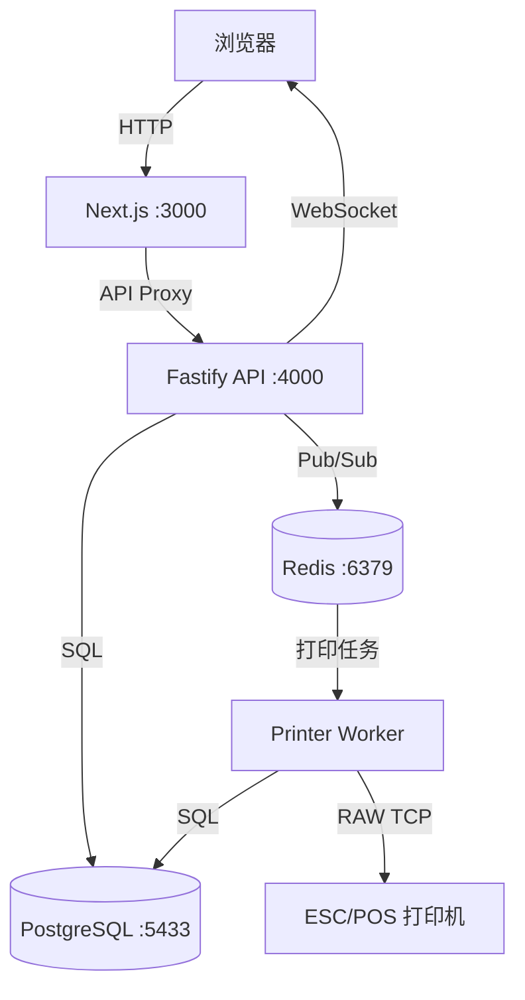

# 🍜 QYPOS · 秦云 POS

<p align="center">
  <a href="./README.md"></a>
  <a href="./README_zh.md"></a>
</p>

<p align="center">
  
  
  
  
  
  
  
  
</p>

<p align="center"><strong>开源轻量级餐饮 POS 系统</strong> — 为单店本地部署而生的 Web 收银解决方案</p>

---

## 📸 运行截图

### 🖥️ 桌面版

<p align="center">
  
  
  
</p>
<p align="center">
  
  
  
</p>

### 📱 平板模式

<p align="center">
  
  
</p>

---

## 📖 目录

- [项目简介](#-项目简介)
- [功能特性](#-功能特性)
- [技术栈](#-技术栈)
- [快速开始](#-快速开始)
- [项目架构](#-项目架构)
- [配置说明](#-配置说明)
- [API 概览](#-api-概览)
- [版本管理](#-版本管理)
- [测试](#-测试)
- [备份与恢复](#-备份与恢复)
- [路线图](#-路线图)
- [更新日志](#-更新日志)
- [贡献指南](#-贡献指南)
- [许可证](#-许可证)

---

## 📋 项目简介

**QYPOS**（秦云 POS）是一款专为小型餐饮门店设计的开源 POS 系统。它提供了完整的前台点餐、后厨打印、后台管理闭环，支持堂食与外卖两种业务模式。

核心设计理念：

| 理念 | 说明 |
|------|------|
| **单店本地部署** | Docker Compose 一键启动，无需云服务 |
| **离线可用** | 纯本地网络运行，不依赖外网 |
| **真实厨房场景** | 后厨打印、菜品状态追踪、多打印机路由 |
| **灵活配置** | 税率、服务费、含税/未税定价自由组合 |

---

## ✨ 功能特性

### 🛎️ 点餐前台
- 可视化餐桌地图，支持拖拽布局编辑
- 堂食开台 + 外卖下单双模式，带确认步骤防止误触
- 登录门禁：所有 POS 操作均需员工身份验证
- 菜品分类浏览、规格选择、加料/备注
- 加料组必选/可选规则与默认选项
- 订单加菜、折扣（封顶至小计金额）、服务费调整
- 多种支付方式：现金、刷卡、扫码、其他，以及 **Dojo Go** 刷卡终端
- 餐桌状态实时更新（WebSocket）

### 🖨️ 后厨打印
- ESC/POS 网络打印机支持
- 厨房单 + 收银小票拆分打印
- 多打印机路由（厨房/收银/吧台独立配置）— 严格模式，缺失时直接报错不静默降级
- 仅锁定新增菜品：已厨打的菜品不会重复出单
- 打印失败自动重试机制，支持打印任务管理界面
- 收银小票显示规格、加料、单价与行合计明细
- 菜品级制作状态追踪（制作中 → 待上菜 → 已上菜）

### 📊 后台管理
- **菜单管理**：分类、菜品、规格、加料组的完整 CRUD；规格预设与组级加料预设支持绑定同步、排序及修改后自动解绑
- **餐桌布局**：可视化拖拽编辑器，区域管理，复制/删除桌台，网格吸附，撤销/重做
- **员工管理**：员工增删改查、角色权限（店主 vs 收银员精细化控制）、排班、考勤、时薪
- **设置中心**：税率、服务费、币种、打印机配置；敏感税务设置需当前账号与 PIN 二次确认
- **数据看板**：今日营业额、订单数、客单价、热销菜品多选下钻与合并趋势图
- **销售报表**：历史数据查询，支持星期几筛选、扩展日期预设（昨天/本周/上周/上月）、可视化图表与 CSV 导出
- **审计日志**：敏感操作全程记录，支持用户、操作类型和精确时间范围组合筛选
- **多语言**：前台与后台界面完整覆盖中文 / 英文
- **代码质量**：ESLint 扁平配置 + `no-undef` 规则，已接入 CI 流水线

### 🔧 运维功能
- 数据库自动/手动备份，支持下载与定时计划界面
- 服务健康检查面板（数据库、Redis、打印队列、备份状态）
- 浏览器离线/断网状态提示及 API 健康异常告警
- Dojo Go 刷卡终端集成（Pay at Counter）

---

## 🛠 技术栈

| 层级 | 技术 |
|------|------|
| 前端 | [Next.js 14](https://nextjs.org/) + React 18 + [Lucide Icons](https://lucide.dev/) |
| API 服务 | [Fastify](https://fastify.dev/) + WebSocket |
| 数据库 | [PostgreSQL 16](https://www.postgresql.org/) |
| 缓存与队列 | [Redis 7](https://redis.io/) |
| 打印服务 | Node.js + ESC/POS 位图渲染 ([@napi-rs/canvas](https://github.com/Brooooooklyn/canvas)) |
| 部署 | [Docker Compose](https://docs.docker.com/compose/) |
| 测试 | Node.js 原生 Test Runner |

---

## 🚀 快速开始

### 前置条件

- [Docker](https://docs.docker.com/get-docker/) & Docker Compose
- Node.js ≥ 18（仅本地开发需要）

### 一键启动

```bash
# 1. 克隆项目
git clone https://github.com/dodio12138/QYPOS.git
cd QYPOS

# 2. 创建环境配置
cp .env.example .env

# 3. 启动所有服务
docker compose up --build
```

### 访问入口

| 服务 | 地址 |
|------|------|
| 🛎️ 点餐前台 | http://localhost:3000 |
| ⚙️ 后台管理 | http://localhost:3000/admin |
| 💚 API 健康检查 | http://localhost:4000/health |

### Dojo 刷卡机（Pay at Counter）

QYPOS 支持通过 Dojo Go 终端收款，同时保留现金、刷卡、扫码和其他方式的手工记账。请在 `.env` 中配置：

```env
DOJO_API_KEY=sk_sandbox_or_prod_key
DOJO_API_BASE_URL=https://api.dojo.tech
DOJO_API_VERSION=2026-02-27
DOJO_SOFTWARE_HOUSE_ID=your_software_house_id
DOJO_RESELLER_ID=your_reseller_id
```

Sandbox Key 只需配置 `DOJO_API_KEY`；QYPOS 会自动使用 Dojo Sandbox 的终端默认值（`softwareHouse1`、`reseller1`）及标准 API 地址和版本。Production Key 仍须配置 Dojo 分配的 Software House ID 与 Reseller ID。API Key 仅由后端容器读取，不要放入 `NEXT_PUBLIC_*` 环境变量。配置后运行 `docker compose up -d --build api web`。收款成功必须以 Dojo Payment Intent 的 `Captured` 状态为准；如果结果不确定，请先核对刷卡机屏幕或终端小票，再使用手工记账，避免重复扣款。

### 种子账号

| 角色 | 用户名 | PIN |
|------|--------|-----|
| 店主 | `Owner` | `0000` |
| 收银员 | `Cashier` | `1111` |
| 后厨 | `Kitchen` | `2222` |

> ⚠️ **安全提示**：生产环境请务必修改默认 PIN 码。

---

## 🏗 项目架构

```
qypos/
├── apps/
│   ├── web/                   # Next.js 前端（POS + Admin）
│   │   ├── src/app/           # 页面路由
│   │   ├── src/components/    # 共享组件
│   │   └── src/lib/           # API 客户端
│   ├── api/                   # Fastify 后端 API
│   │   └── src/
│   │       ├── server.js      # 主服务入口
│   │       └── services/      # 业务服务
│   │           ├── permissions.js   # 权限校验
│   │           ├── printers.js      # 打印机路由
│   │           └── validation.js    # 数据校验
│   └── printer-service/       # 打印队列 Worker
│       └── src/worker.js      # Redis 消费 + ESC/POS 渲染
├── packages/
│   └── shared/                # 共享代码包
│       └── src/index.js       # 金额计算 + 常量定义
├── db/
│   ├── init.sql               # 数据库初始化 schema + 种子数据
│   └── migrations/            # 增量迁移脚本
├── scripts/
│   ├── backup-db.sh           # 数据库备份脚本
│   └── restore-db.sh          # 数据库恢复脚本
├── tests/                     # 测试用例
├── docker-compose.yml         # Docker 编排
└── .env.example               # 环境变量模板
```

### 服务间通信



---

## ⚙️ 配置说明

通过 `.env` 文件进行配置：

| 变量 | 默认值 | 说明 |
|------|--------|------|
| `POSTGRES_DB` | `qypos` | 数据库名称 |
| `POSTGRES_USER` | `qypos` | 数据库用户 |
| `POSTGRES_PASSWORD` | `qypos_password` | 数据库密码 |
| `DATABASE_URL` | `postgres://...` | API 数据库连接串 |
| `REDIS_URL` | `redis://redis:6379` | Redis 连接串 |
| `API_PORT` | `4000` | API 服务端口 |
| `PRINTER_DEFAULT_HOST` | `192.168.1.100` | 默认打印机 IP |
| `PRINTER_DEFAULT_PORT` | `9100` | 默认打印机端口 |
| `BACKUP_DIR` | `/app/backups` | 备份文件存储路径 |

---

## 📡 API 概览

| 端点 | 方法 | 说明 | 权限 |
|------|------|------|------|
| `/auth/login` | POST | 用户登录（返回 Token） | 公开 |
| `/floor-layouts` | GET/PUT | 餐桌布局读写 | 读公开 / 写需登录 |
| `/orders` | POST | 创建订单 | `create_order` |
| `/orders/:id/submit` | POST | 提交订单并触发打印 | `create_order` |
| `/orders/:id/payments` | POST | 记录付款 | `take_payment` |
| `/orders/:id/items` | POST | 加菜 | `create_order` |
| `/menu/categories` | CRUD | 菜单分类管理 | `manage_menu` |
| `/menu/items` | CRUD | 菜品管理 | `manage_menu` |
| `/menu/option-presets` | CRUD | 规格与加料预设管理 | `manage_menu` |
| `/menu/modifier-groups/:id/apply-option-preset` | POST | 将预设绑定到指定加料组 | `manage_menu` |
| `/settings` | GET/PUT | 系统设置 | 读公开 / 写需权限 |
| `/dashboard/today` | GET | 今日看板数据 | `view_dashboard` |
| `/reports/sales` | GET | 销售报表 | `view_reports` |
| `/print-jobs` | GET | 打印任务列表 | `view_kitchen` |
| `/audit-logs` | GET | 审计日志（后台支持时间、用户、操作筛选） | `view_audit_logs` |
| `/health` | GET | 服务健康检查 | 公开 |

---

## 🔖 版本管理

QYPOS 遵循[语义化版本](https://semver.org/lang/zh-CN/)（SemVer 2.0.0）。主版本号定义在根目录 [`package.json`](./package.json) 中，所有工作区包（`apps/*`、`packages/*`）统一使用该版本。

### 查看当前版本

| 方式 | 命令 / 地址 |
|------|-----------|
| **API 健康检查接口** | `curl http://localhost:4000/health` → `{"ok":true,"version":"0.1.0"}` |
| **包文件** | `node -e "console.log(require('./package.json').version)"` |

### 发布流程

1. 更新 `package.json` 中的 `version` 字段（根目录，也可选择同步更新子包）。
2. 更新 `README.md` 和 `README_zh.md` 中的版本徽章。
3. 在 [`CHANGELOG_zh.md`](./CHANGELOG_zh.md) 中记录变更，格式遵循 [Keep a Changelog](https://keepachangelog.com/en/1.0.0/)。
4. 打标签发布：`git tag -a v0.1.0 -m "Release v0.1.0" && git push origin v0.1.0`。

---

## 🧪 测试

```bash
# 运行全部测试
npm test

# 仅运行计算逻辑测试
node --test tests/calculations.test.mjs

# 运行 API 集成测试（需要已启动服务）
API_BASE=http://localhost:4000 node --test tests/api.integration.test.mjs
```

测试覆盖：
- ✅ 金额计算（含税/未税、折扣、服务费）
- ✅ 权限校验逻辑
- ✅ 厨房打印锁定
- ✅ 付款金额校验
- ✅ 打印机严格路由
- ✅ API 集成测试（可选）
- ✅ 预设绑定同步、默认选项、自动解绑及敏感设置二次验证

---

## 💾 备份与恢复

```bash
# 创建备份
npm run backup

# 从备份恢复
npm run restore -- backups/qypos-YYYYMMDD-HHMMSS.sql
```

也可以在后台管理界面（/admin → 运维）中手动触发备份、设置自动备份计划或下载备份文件。

---

## 🗺️ 路线图

### ✅ v0.1.0 — MVP（发布于 2026-06-25）
- [x] 点餐前台 + 后台管理完整闭环
- [x] 堂食 & 外卖双模式
- [x] ESC/POS 网络打印
- [x] 可视化餐桌布局编辑
- [x] 菜单全量管理
- [x] 税率/服务费灵活配置
- [x] 基础看板 & 销售报表
- [x] 数据库备份恢复
- [x] 审计日志
- [x] 后台可收起侧栏导航

### 🚧 v0.2.0 — 开发中
- [x] 员工管理 UI（增删改查）
- [ ] PIN 哈希
- [ ] 菜单图片上传
- [ ] 套餐组合功能
- [x] 报表可视化图表
- [ ] 班次交接 & 日结
- [x] 真实支付终端对接（Dojo Go）
- [x] 多语言前端（中/英完整覆盖）
- [x] 规格预设与加料组绑定
- [x] 排班 & 考勤

### 🔮 v0.3.0+ — 计划中
- [ ] 多店支持
- [ ] 扫码点餐（顾客端）
- [ ] 库存管理
- [ ] 会员系统
- [ ] 第三方外卖平台对接

---

## 📝 更新日志

详见 [`CHANGELOG_zh.md`](./CHANGELOG_zh.md)，记录了各版本之间的详细变更。

---

## 🤝 贡献指南

欢迎所有形式的贡献！请查看 [CONTRIBUTING_zh.md](./CONTRIBUTING_zh.md) 了解详情。

### 本地开发

```bash
# 1. 安装依赖
npm install

# 2. 启动基础设施
docker compose up -d postgres redis

# 3. 分别启动各服务开发模式
cd apps/api && npm run dev          # API :4000
cd apps/web && npm run dev          # Web :3000
cd apps/printer-service && npm run dev  # Printer Worker
```

---

## 📄 许可证

本项目基于 [MIT License](./LICENSE) 开源。

---

<p align="center">
  <sub>Made with ❤️ for small restaurants everywhere 🍜</sub>
</p>
